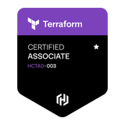

---
hide:
  - navigation
  - toc
---

## :material-certificate: Certifications

---

<figure markdown="span">
[{ width=200 }](https://www.credly.com/earner/earned/badge/c51c0b62-3825-4157-9ac9-2d43573a381b)
<figcaption>AWS Certified Cloud Practitioner</figcaption>
</figure>

<figure markdown="span">
[{ width=200 }](https://www.credly.com/earner/earned/badge/53b4575e-236d-42ec-84ef-bdb4c0238c72)
<figcaption>HashiCorp Certified: Terraform Associate (003)</figcaption>
</figure>

<figure markdown="span">
[{ width=200 }](https://www.credly.com/earner/earned/badge/29e0171f-7fed-4069-9170-c816905221c0)
<figcaption>Building AI-Powered Search with MongoDB Vector Search</figcaption>
</figure>

<figure markdown="span">
[{ width=200 }](https://www.credly.com/earner/earned/badge/195e2152-6146-4b07-9461-1e91ba772acf)
<figcaption>Kubernetes for App Developers</figcaption>
</figure>

<figure markdown="span">
[{ width=200 }](https://www.credly.com/earner/earned/badge/b0bbb4bf-33ae-4547-bf73-ef25b023a5fb)
<figcaption>Kubernetes Administration</figcaption>
</figure>

 

<!-- [ Back to Home](./index.md){ .md-button } -->
